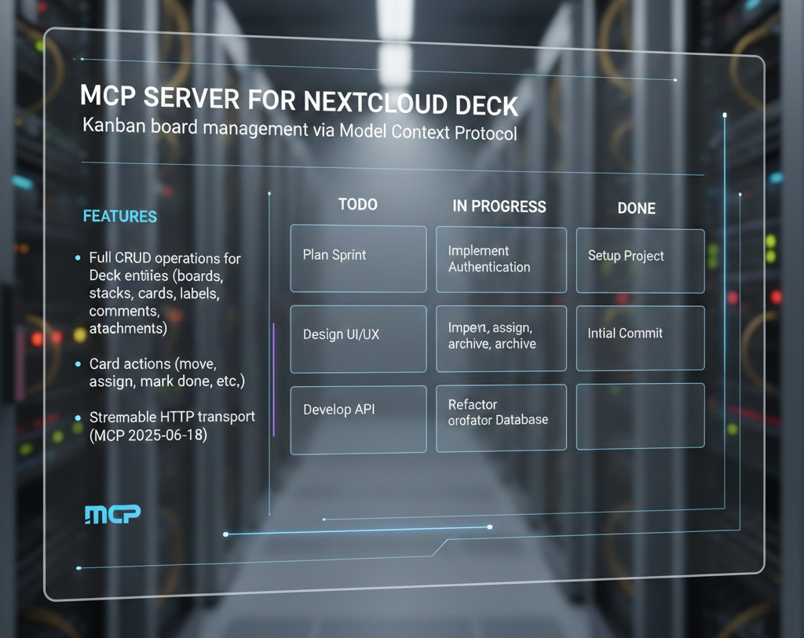

# MCP Nextcloud Deck

MCP Server for Nextcloud Deck - Kanban board management via Model Context Protocol.

## Features

- Full CRUD operations for Deck entities (boards, stacks, cards, labels, comments, attachments)
- Card actions (move, assign, archive, mark done, etc.)
- Stateless per-request architecture
- Streamable HTTP transport (MCP 2025-06-18)

## Installation

```bash
npm install
npm run build
```

## Configuration

Copy `.env.example` to `.env` and configure:

```env
PORT=3261
NEXTCLOUD_URL=https://your-nextcloud-server.com
NEXTCLOUD_USERNAME=your-username
NEXTCLOUD_PASSWORD=your-password-or-app-token
```

## Usage

```bash
npm start
```

Server will start on port 3261 (default).

## MCP Tools

| Tool | Description |
|------|-------------|
| `deck_create` | Create entity (board, stack, card, label, comment, attachment) |
| `deck_read` | Read entities with filtering |
| `deck_update` | Update entity |
| `deck_delete` | Delete entity |
| `deck_action` | Perform actions (move, assign, archive, etc.) |

## Endpoints

- `GET /health` - Health check
- `POST /mcp` - MCP endpoint

## License

MIT
